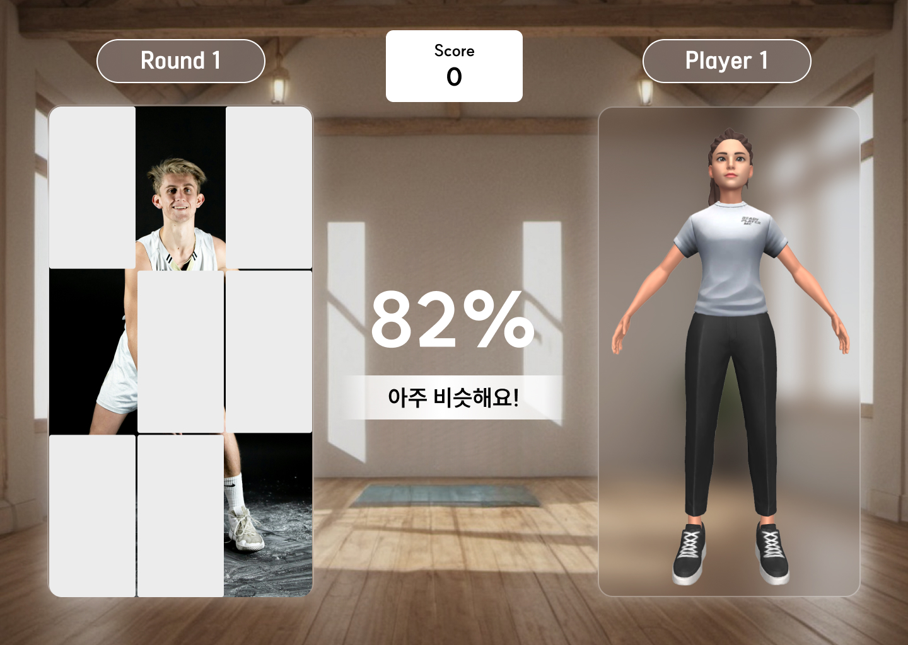
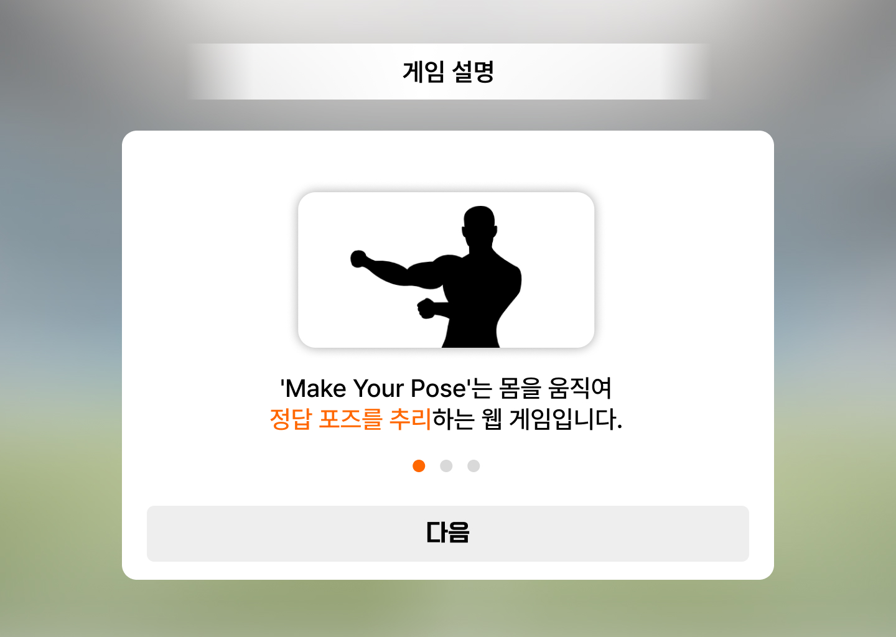
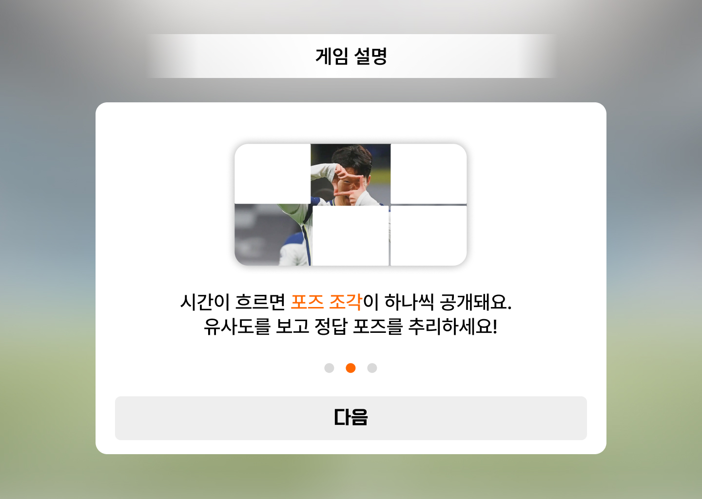
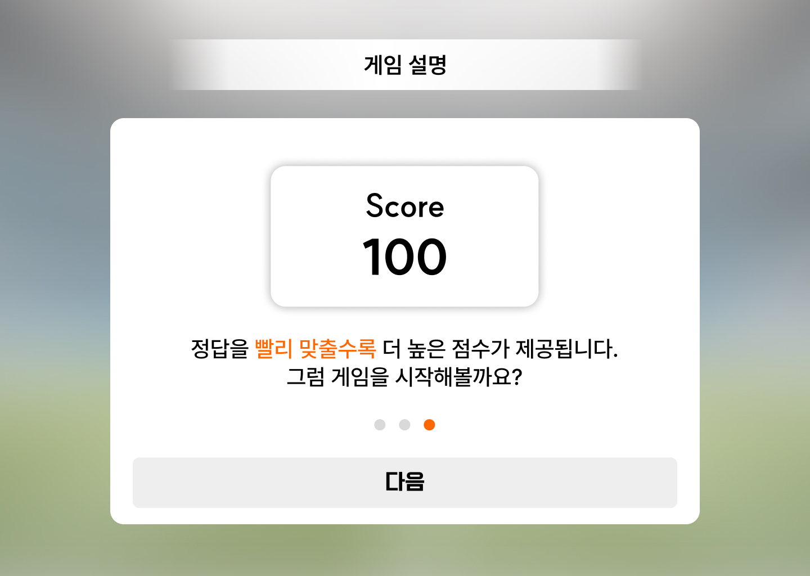

# Make Your Pose

## 👥 팀 구성

- 팀장: 김지은
- 팀원: 강희룡
- 지도교수: 오경수
- 이메일: [makeyourpose@gmail.com](mailto:makeyourpose@gmail.com)

## 🎮 작품 소개

**AI 기반 실시간 포즈 매칭 웹 게임**  
사용자가 실시간으로 정답 포즈와 일치하도록 자신의 포즈를 맞추는 웹 기반 인터랙티브 게임입니다.

🔗 **작품 시연 링크**: [바로가기](https://make-your-pose.site/)

## 📝 기획 의도

Make Your Pose는 '새장 안에 갇힌 새'로 밈이 된 예능 <도전! 수퍼모델 코리아 3> 속 포즈 대결에서 영감을 받아, 'AI가 이 게임의 심판을 보면 어떨까?'라는 발상에서 시작되었다. 사용자는 직접 몸을 움직이면서 정답 포즈를 추리해야 하고, AI 라이브러리를 이용해 포즈의 유사도를 제공한다.

## ✨ 주요 기능

- 실시간 포즈 인식 및 정답 포즈와의 유사도 측정
- 다양한 난이도와 문제 유형 제공
- 포즈 유사도 시각화
- 제스처 기반 UI 조작

## 📷 작품 설명 이미지

   

## 🛠️ 주요 기술 스택

- **Frontend**: React, Vite, Panda CSS
- **AI / Pose Recognition**: MediaPipe Pose
- **Backend**: Cloudflare

## 📅 개발 기간

2024.12 ~ 2025.05
